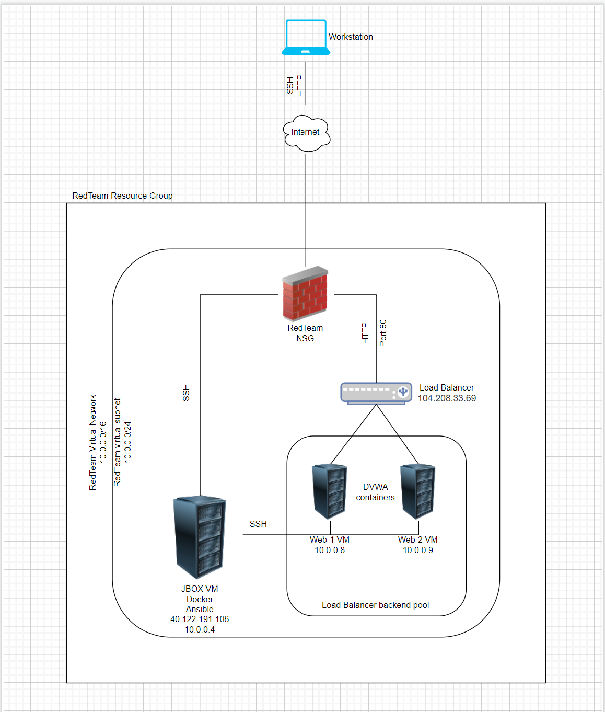

## Automated ELK Stack Deployment

The files in this repository were used to configure the network depicted below.

These files have been tested and used to generate a live ELK deployment on Azure. They can be used to either recreate the entire deployment pictured above. Alternatively, select portions of the YAML file may be used to install only certain pieces of it, such as Filebeat.

[ELK playbook](ansible/configure_elkVM.yml)

This document contains the following details:
- Description of the Topologu
- Access Policies
- ELK Configuration
  - Beats in Use
  - Machines Being Monitored
- How to Use the Ansible Build

### Description of the Topology

The main purpose of this network is to expose a load-balanced and monitored instance of DVWA, the D*mn Vulnerable Web Application.

Load balancing ensures that the application will be highly reliable, in addition to restricting access to the network.
- What aspect of security do load balancers protect? What is the advantage of a jump box?_
- Load balancers protect the availability of certain applications or services. If one server goes down, all traffic will be directed to another server running the same application. The advantage of a jump box is you could use it as a sort of hub where you can set a network security group or firewall that only allows specified traffic through. Whatever rules you set then make jumping to whatever server is connected to the jump box much more secure than just accessing a confidential server on a public network with no specified rules.

Integrating an ELK server allows users to easily monitor the vulnerable VMs for changes to the data and system logs.
- What does Filebeat watch for?
    Filebeat monitors log files or specified locations. It also collects log events and forwards them to elasticsearch or logstash.
- What does Metricbeat record?
    Takes the metrics and statistics that it collects and ships them to the output that you specify such as elasticsearch or logstash

The configuration details of each machine may be found below.
_Note: Use the [Markdown Table Generator](http://www.tablesgenerator.com/markdown_tables) to add/remove values from the table_.

| Name     | Function | IP Address | Operating System |
|----------|----------|------------|------------------|
| Jump Box | Gateway  | 10.0.0.1   | Linux            |
| Web-1     | DVWA         | 10.0.0.8           | Linux                 |
| Web-2    | DVWA         | 10.0.0.9           | Linux                 |
| Elk-VM     | Monitor         | 10.1.0.4           | Linux                 |

### Access Policies

The machines on the internal network are not exposed to the public Internet. 

Only the Jumpbox machine can accept connections from the Internet. Access to this machine is only allowed from the following IP addresses:
- 73.78.14.91

Machines within the network can only be accessed by an ansible container inside of the jumpbox that uses the correct ssh key.
- Which machine did you allow to access your ELK VM? What was its IP address? The Jump box has access to the Elk VM and the IP address is 10.0.0.4

A summary of the access policies in place can be found in the table below.

| Name     | Publicly Accessible | Allowed IP Addresses |
|----------|---------------------|----------------------|
| Jump Box | Yes              | 73.78.14.91    |
| Vnet         | No                    | 10.0.0.4                     |
| Elk-VM         | Yes                    | 73.78.14.91                     |

### Elk Configuration

Ansible was used to automate configuration of the ELK machine. No configuration was performed manually, which is advantageous because if we were working with a network of several machines, configuring each of those machines would take an obscene amount of time. Automating it gets the job done in a fraction of the time it would take to do it manually. Manual labor also increases the chances for mistakes during configuration. Running a playbook removes any margin for human error.

The playbook implements the following tasks:
- Installs Docker
- Installs python3-pip
- Installs docker python pip module
- Runs sysctl to increase memory 
- Downloads and installs docker container and enables the service on boot

The following screenshot displays the result of running `docker ps` after successfully configuring the ELK instance.

### Target Machines & Beats
This ELK server is configured to monitor the following machines:
- Web-1: 10.0.0.8
- Web-2: 10.0.0.9

We have installed the following Beats on these machines:
- Filebeat
- Metricbeat

These Beats allow us to collect the following information from each machine:
- Filebeat is a log monitoring tool, it collects log events such as audit logs, deprecation logs, gc logs, server logs, and slow logs and sends them to either Elasticsearch or Logstash
- Metricbeat is a lightweight shipper that collects metrics from the operating system and running services on a server, it then takes those metrics and statistics and ships them to the desired output, whether it is Elasticsearch or Logstash.

### Using the Playbook
In order to use the playbook, you will need to have an Ansible control node already configured. Assuming you have such a control node provisioned: 

SSH into the control node and follow the steps below:
- Copy the configure_elkVM.yml file to the Jumpbox.
- Update the Ansible hosts file to include a header defining a group of machines as "Elk" and beneath that inserting the IP addresses of the hosts
- Run the playbook, and navigate to Elk-VM to check that the installation worked as expected.
- To double check that the elk server is up in running here is the URL: [http://20.121.24.117:5601/app/kibana](http://20.121.24.117:5601/app/kibana)

_As a **Bonus**, provide the specific commands the user will need to run to download the playbook, update the files, etc._
sudo ansible-playbook configure_elkVM.yml
